

 

## Carnaval de rua em Brasília. Com elegância.

  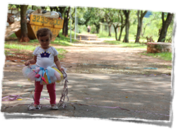

  Brasília é a cidade sem carnaval, sem tradição. Ruas vazias. Todos viajam pra brincar (ou pra se esconder) em outros cantos.
  
    
  
  Será?
  

  
  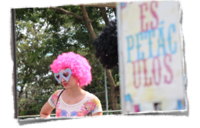

  Ou então se conformam com o carnaval que sobrou, saem pra ver um pouco de esbórnia e voltam frustrados pra casa porque o carnaval estava 'vazio'. Ou vão ao sambódromo imitar a televisão.

    

  Será?

  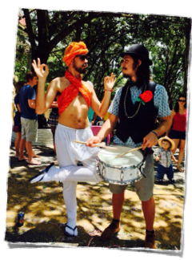

  Carnaval hoje em dia é uma multidão enorme (a maior possível), apertada, com um bando de estranhos bêbados e suados passando a mão em todo mundo, ao som de um xeco xeco alto e acelerado. Acho que o carnaval perdeu mesmo seu significado.

    

  Será?

  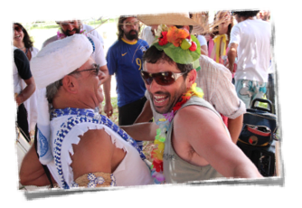

  Não poderia ao acaso voltar a ser um momento bonito de celebração e brincadeira? 

  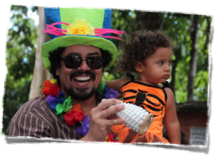

  Reunir apenas os amigos mais queridos e os amigos dos amigos? 

  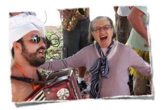

  Que tal se pudéssemos brincar, ao mesmo tempo, ao lado dos filhos, dos amigos e da vovó? 

  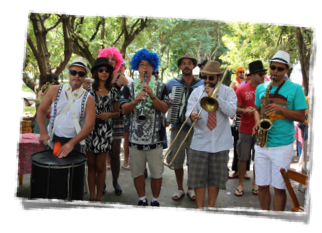

  Porque multidão apertada? Não podemos brincar confortáveis, sem esconder as carteiras? 

  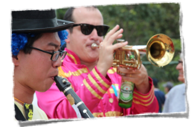

  E ouvir, num volume que nos permita cantar juntos e conversar, uma marchinha linda e sem pressa com o mesmo velho versinho que ainda emociona? 

  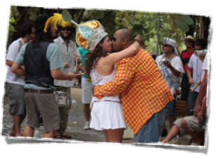

  Que tal seguir cantando e sambando, passinho a passinho, ao lado do seu bem?

  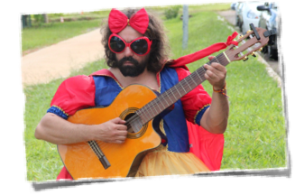

  Façamos um carnaval de rua com elegância. Fantasias e instrumentos a postos!

  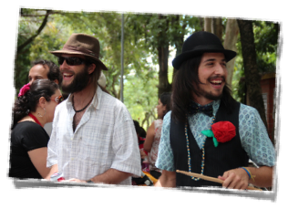

  Não é preciso viajar, "nem se refugiar em lugar mais bonito". O lugar mais bonito é aqui. As pessoas mais queridas estão aqui. O carnaval está dentro de ti.

  Talvez você ainda não tenha percebido, mas o [carnaval](http://www.ebc.com.br/noticias/brasil/2013/02/em-brasilia-blocos-de-rua-atraem-familias-e-criancas-no-domingo-de-carnaval) de [Brasília](https://www.facebook.com/babydolldenylon) está [mudando](https://aparelhinho.wordpress.com/sobre/).

  E nós queremos fazer parte disso.
  
   

  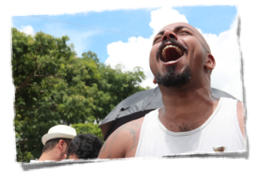

  Neste carnaval, em algum lugar da cidade, o <b style='white-space: nowrap;'>Vai Quem Fica</b> arrasta suas sandálias pelo terceiro ano consecutivo.

Se seu coração bater na mesma cadência, e você quiser nos acompanhar, **inscreva-se na nossa lista** que te avisaremos onde será.

 

  <!-- Begin MailChimp Signup Form -->
  <link href="//cdn-images.mailchimp.com/embedcode/classic-081711.css" rel="stylesheet" type="text/css">
  
  

    
    <form action="//github.us2.list-manage.com/subscribe/post?u=1add2b0d2d8fac83d25d4a1fe&amp;id=5a781cb5f1" method="post" id="mc-embedded-subscribe-form" name="mc-embedded-subscribe-form" class="validate" target="_blank" novalidate>
        

          

          	<label for="mce-EMAIL">Email  *
          </label>
          	<input type="email" value="" name="EMAIL" class="required email" id="mce-EMAIL">
          

          

          	<label for="mce-FNAME">Primeiro Nome </label>
          	<input type="text" value="" name="FNAME" class="" id="mce-FNAME">
          

        	

        		

        		

        	
    <!-- real people should not fill this in and expect good things - do not remove this or risk form bot signups-->
          
<input type="text" name="b_1add2b0d2d8fac83d25d4a1fe_5a781cb5f1" tabindex="-1" value="">

          
<input type="submit" value="Me inscrever!" name="subscribe" id="mc-embedded-subscribe" class="button">

          
          
            <b>Fique tranquilo!</b> Nada de <i>spam</i>; você poderá se desinscrever a qualquer momento!  
          
          
          
        

    </form>
  

  <!--End mc_embed_signup-->

   

 
