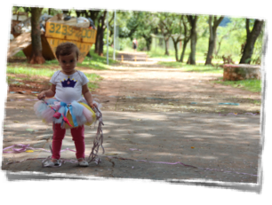
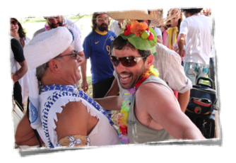
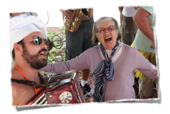
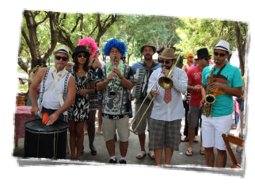
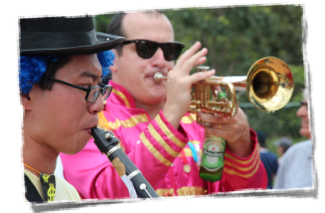
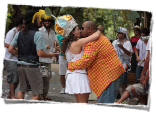
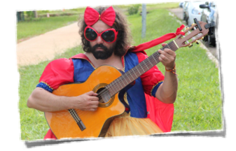
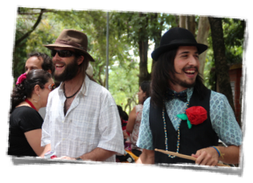
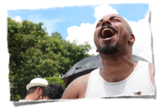
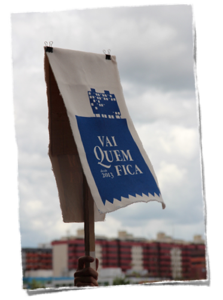



## Carnaval de rua em Brasília. Com elegância.

  

  Brasília é a cidade sem carnaval, sem tradição. Ruas vazias. Todos viajam pra brincar (ou pra se esconder) em outros cantos.

    

  Será?

  

  Ou então se conformam com o carnaval que sobrou, saem pra ver um pouco de esbórnia e voltam frustrados pra casa porque o carnaval estava 'vazio'. Ou vão ao sambódromo imitar a televisão.

    

  Será?

  

  Carnaval hoje em dia é uma multidão enorme (a maior possível), apertada, com um bando de estranhos bêbados e suados passando a mão em todo mundo, ao som de um xeco xeco alto e acelerado. Acho que o carnaval perdeu mesmo seu significado.

    

  Será?

  

  Não poderia ao acaso voltar a ser um momento bonito de celebração e brincadeira?

  

  Reunir apenas os amigos mais queridos e os amigos dos amigos?

  

  E se a gente pudesse brincar, ao mesmo tempo, ao lado dos filhos, dos amigos e da vovó?

  

  Porque multidão apertada? Não podemos brincar confortáveis, de chinelos e sem esconder as carteiras?

  

  E ouvir, sem gritaria e sem pressa, uma marchinha linda, com o mesmo velho versinho que ainda emociona?  

  

  Que tal seguir cantando e sambando, passinho a passinho, ao lado do seu bem?

  

  Façamos um carnaval de rua com elegância! Fantasias e instrumentos a postos!

  

  Não é preciso viajar, "nem se refugiar em lugar mais bonito". O lugar mais bonito é aqui. As pessoas mais queridas estão aqui. O carnaval está dentro de ti.

  Talvez você ainda não tenha percebido, mas o [carnaval](http://www.ebc.com.br/noticias/brasil/2013/02/em-brasilia-blocos-de-rua-atraem-familias-e-criancas-no-domingo-de-carnaval) de [Brasília](https://www.facebook.com/babydolldenylon) está [mudando](https://aparelhinho.wordpress.com/sobre/).

   

  E nós queremos fazer parte disso.

   

  

  Neste carnaval, em algum lugar da cidade, o <b style='white-space: nowrap;'>Vai Quem Fica</b> arrasta suas sandálias pelo terceiro ano consecutivo.

Se seu coração bater na mesma cadência, e você quiser nos acompanhar, **inscreva-se na nossa lista** que te avisaremos onde será.

 

  (se quiser participar do próximo ano, <a href='{{base}}'>clique aqui</a>)

   

 

  

    Que tal &nbsp;
    

    &nbsp; isso com seus amigos?
  

